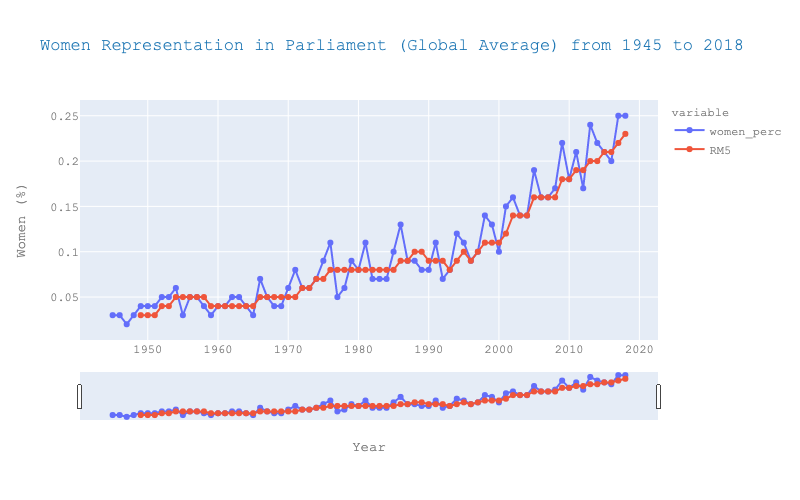
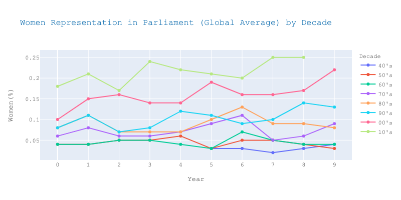
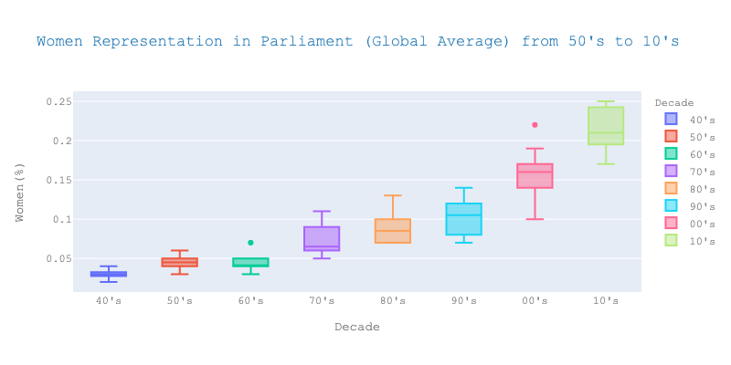
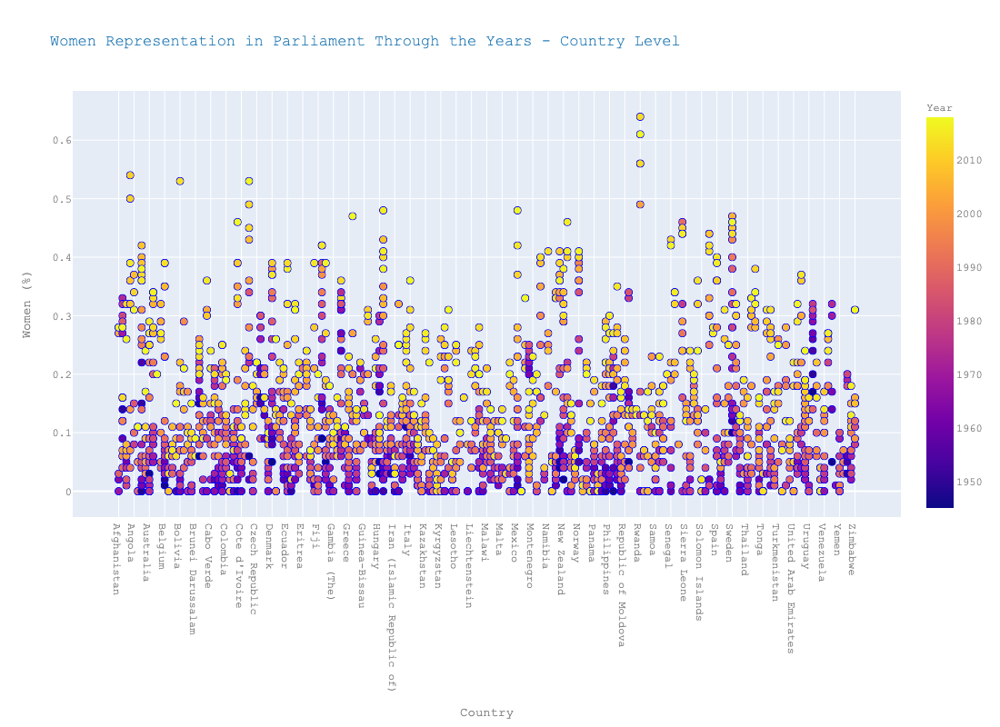
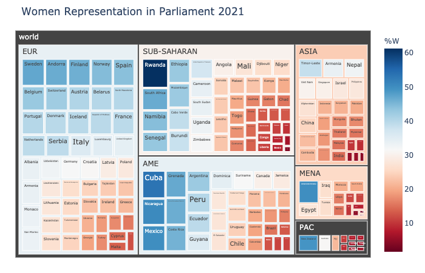

# Women Representation in Parliaments

In many countries, women have been under-represented in the government and different institutions. In the present demonstration, we are exploring gender balance in national parliaments since 1945 through interactive plots based on historical data on the proportion of seats held by women worldwide from Inter-Parliamentary Union ([IPU Parline - Global data on national parliaments](https://data.ipu.org/historical-women) )
 using [Plotly](https://plotly.com/python/) Python's graphing library.

## World - Historical Background (1948 to 2018)

 *Figure 1* shows the yearly percentage of women's participation in parliaments averaged for all countries around the world from 1945 to 2018. It is apparent that there is a historical tendency of insufficient representation, although women's percentage in national parliaments is constantly increasing; there was an impressive rise through the last 20 years from 10% in 2000 to almost 25% in 2018.

<figure>

<figcaption align = "center"><b>Figure 1: Global Average of Women's Parliament Participation from 1945 to 2018.</b></figcaption>

</figure>

The rise is more obvious looking at the global average of women's participation in national parliaments by decade as shown in *Figure 2* and *Figure 3*. In the '50s and '60s, women accounted only for 5% of parliament members whilst in the late '70s, their percentage almost doubled to 9% of the total. '80s and '90s followed the same upward trend with 1.4% and 1.7% increase in the global average from the previous decade respectively. However, the highest percentage increase through the years was from '90s to '00s (almost 5.5%); the median global average percentage of women participation reached 16% in the '00s compared to 10.5% in the '90s. Women's participation continued to rise to the same rate from 2000 onwards, reaching almost 25% in recent years. 

| | |
|---|---|
|Figure 2: Global Average of Women Parliament Participation by Decade. |Figure 3: Boxplots of Global Average of Women Parliament Participation by Decade.|

## Country Level - Participation through the years

Examining women's participation by country level, we can see parliaments all over the world slowly moving in the direction of gender parity. In the past 25 years, the implementation of legislated or voluntary gender quotas have spread to all regions of the world, driving up women’s representation in parliaments. Rwanda, United Arab Emirates, Mexico and Nicaragua are examples of the successful implementation of legislated quotas that yielded positive results.

<figure>

<figcaption align = "center"><b>Figure 4: Women's Parliament Participation from 1945 to 2018 - Country Level.</b></figcaption>

</figure>

As of 2021, in five countries; Rwanda, Cuba, Nicaragua, Mexico, and the United Arab Emirates, women now account for 50 per cent or more MPs in their lower or single chambers. A twenty six further countries have reached or surpassed 40 per cent, including eleven countries in Europe, six in Sub-Saharan Africa, eight in Americas and one in the Pacific. However, there are countries in all regions except Europe that still have lower or single parliamentary chambers with less than 5 per cent women.

<figure>

<figcaption align = "center"><b>Figure 5: Women's Parliament Participation in 2021.</b></figcaption>

</figure>