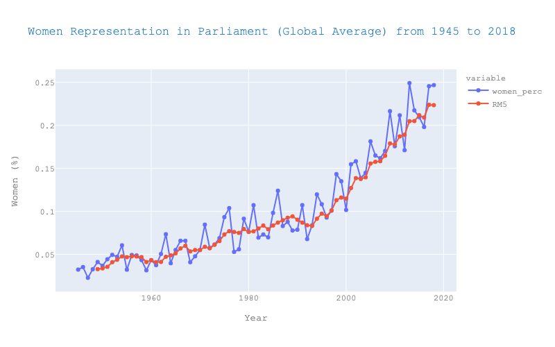
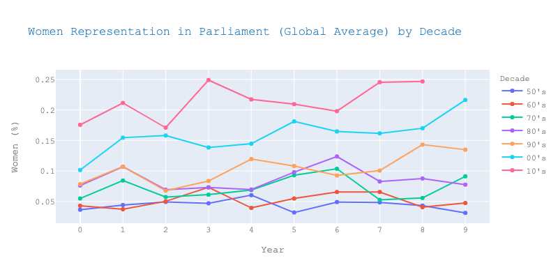
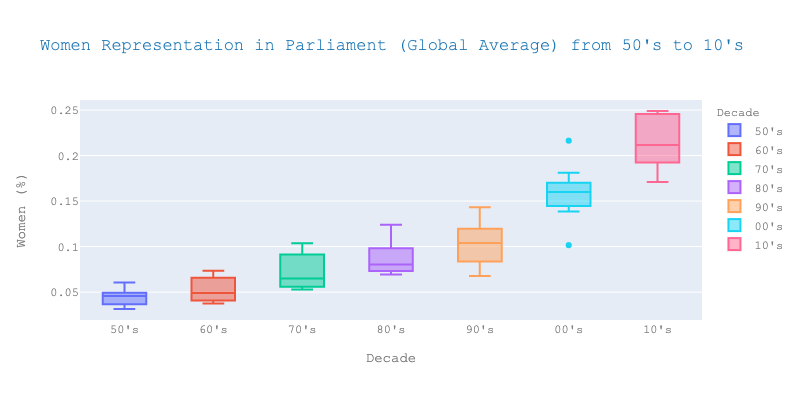
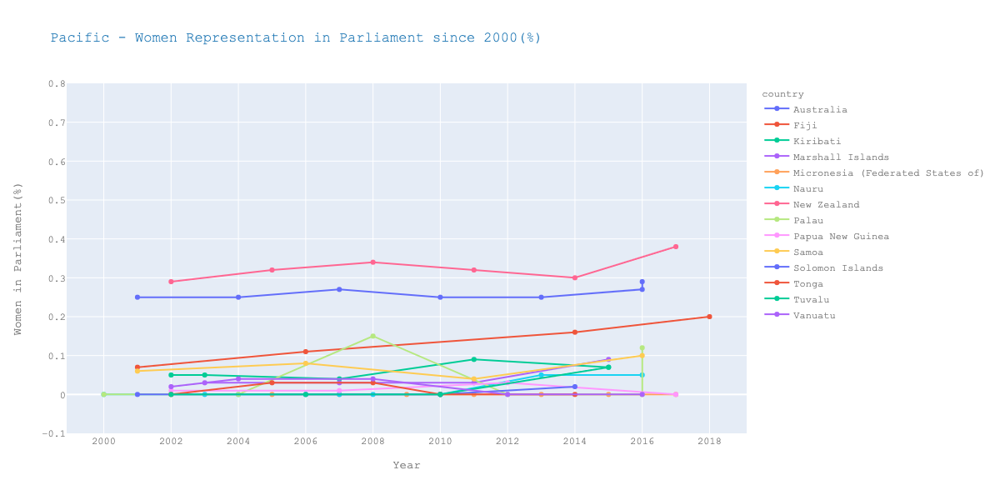
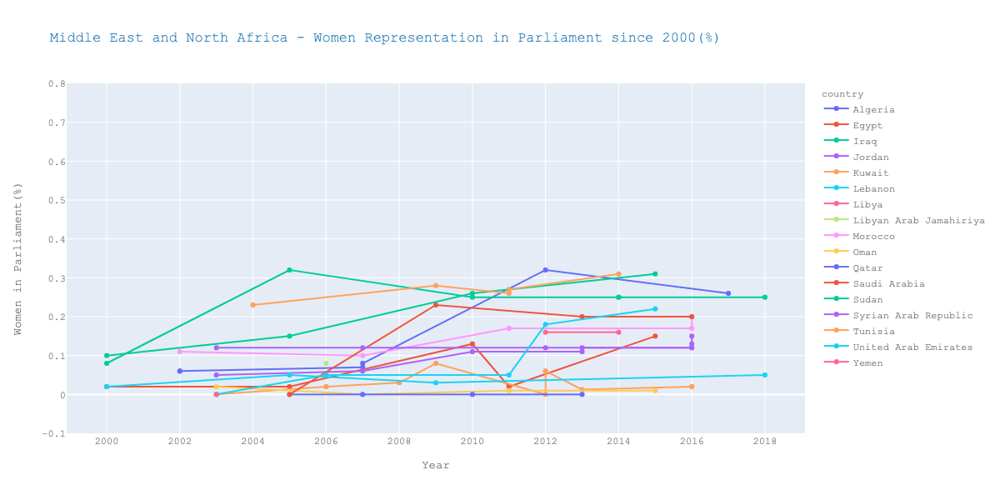
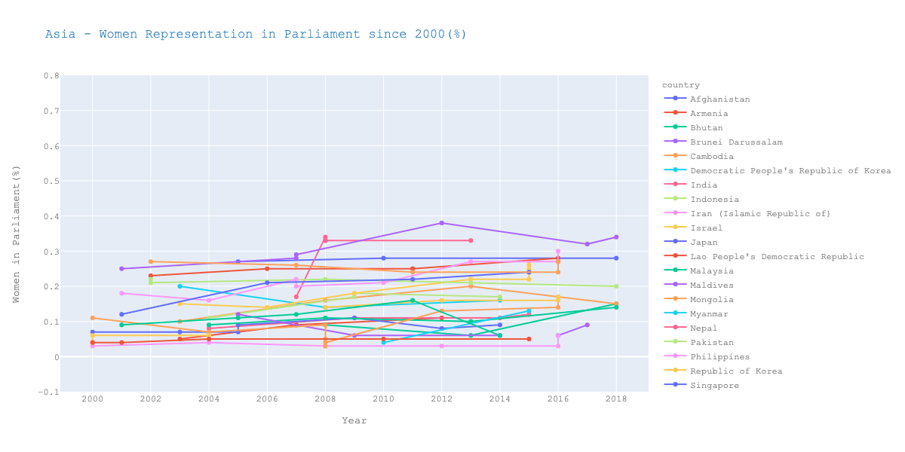
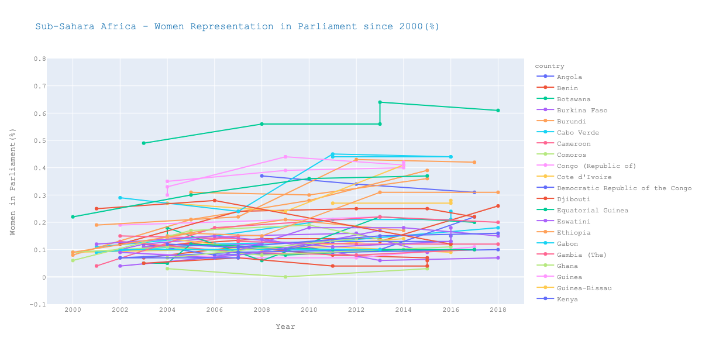
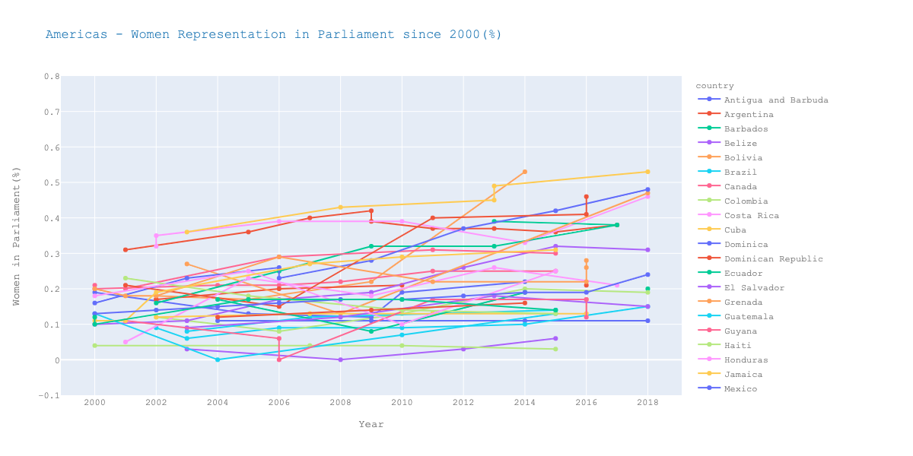
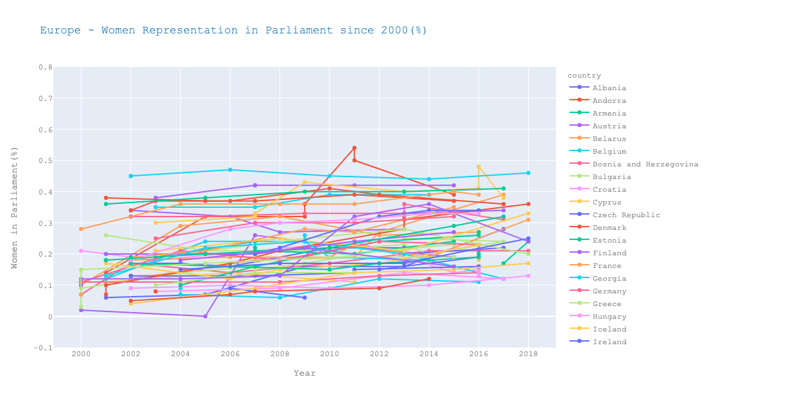

# Women Representation in Parliaments

## Historical Background (1948 to 2018)

In many countries, women have been under-represented in the government and different institutions. *Figure 1* shows the percentage of women's participation in parliaments averaged for all countries around the world from 1945 to 2018. It is apparent that there is a historical tendency of insufficient representation, although women's percentage in national parliaments is constantly increasing; there was an impressive rise through the last 20 years from 10% in 2000 to almost 25% in 2018.

<figure>

<figcaption align = "center"><b>Figure 1: Global Average of Women's Parliament Participation from 1945 to 2018.</b></figcaption>

</figure>

The rise is more obvious looking at the global average of women's participation in national parliaments by decade as shown in *Figure 2* and *Figure 3*. In the '50s and '60s, women accounted only for 5% of parliament members whilst in the late '70s, their percentage almost doubled to 9% of the total. '80s and '90s followed the same upward trend with 1.4% and 1.7% increase in the global average from the previous decade respectively. However, the highest percentage increase through the years was from '90s to '00s (almost 5.5%); the mean global percentage of women participation reached 16% in the '00s compared to 10.4% in the '90s. Women's participation continued to rise to the same rate from 2000 onwards, reaching almost 25% in recent years. 

| | |
|---|---|
|Figure 2: Global Average of Women Parliament Participation by Decade. |Figure 3: Boxplots of Global Average of Women Parliament Participation by Decade.|

## Regional Trends

In the last 20 years, women's representation in parliament for the Pacific region has been placed at the very bottom of the global list. Female representation accounting for less than 10% for the majority of the countries with the exception of Australia and New Zealand (29% and 38% in most recent elections respectively). Moreover, as shown in the Figure below (*Figure 2*) the Pacific region has the most parliaments with no women members at all (Palau, Solomon Islands, Tuvalu, Tonga, Vanuatu, Papua New Guinea, Micronesia).

| | |
|---|---|
|Figure 2: Women's Parliament Participation - Pacific. |Figure 3: Women's Parliament Participation - Middle East and North Africa.|

The middle east and north Africa (MENA) regions also ranks low in women participation in politics. Until recently, the Persian Gulf countries still included parliaments with no women at all; only in 2000 women were granted full political rights. As shown in Figure 2, Yemen, Oman, Kuwait, and Qatar have not reached more than 10% women in their national legislature since 2000, although, Iraq, Saudi Arabia, and United Arab Emirates have crossed the 20% barrier. Sudan, Algeria and Morroco have achieved the highest rise in parliamentary representation since 2000 whilst many countries in the MENA region have introduced quota systems to guarantee female representation in parliament.

*Figure 3* shows that Asia has recorded the slowest growth rate in women's representation in parliament since 2000. In the recent years, only Timor-Leste and Nepal (highest growth rate) have surpassed the 30 per cent mark of women's representation due to post-conflict legal reforms[**site 2020-women in parliament**]. Reforms of the same nature were applied to Afghanistan after 2001 to guarantee women’s full and equal participation in political life resulting in 28% of total seats allocated to female candidates in 2018.

| | |
|---|---|
|Figure 4: Women's Parliament Participation - Sub-Suhara Africa. |Figure 5: Women's Parliament Participation - Pacific.|

Sub-Saharan Africa countries recorded similar growth rates with the majority reaching up to 15% in women's representation. Although, certain sub-Saharan countries have showed significant growth: Namimbia's female representation rose to 42% in 2014, Senegal's douubled its figure to 43% in 2012 as did Seychelles. In the most recent years, Mozambique and South-Africa have surpassed the 30% threshold whilst Rwanda lead the way globally being the only country in the world where female pepresentation exceeded 60%. It is worth noticing that most of the sub-Saharan countries that have recorded high level of women's representation have achieved this through the use of quotas [1].

||  |
|---|---|
| Figure 6: Women's Parliament Participation - Americas.|Figure 7: Women's Parliament Participation - Europe.|

Women's participation in parliament in the Americas has recorded the highest growth in the last 20 years with Cuba, Bolivia, Mexico and Nicaragua being amongst the countries with the highest share of women representation in the world in 2018. Europe is the only region in the world with at least 10% women in parliament for every single country in the region. The Nordic countries distinguish from the rest being the only subregion to have topped the 40 per cent threshold, however there is no country in Europe that has achieved parity in goverment.

## Women's Participation as of 1st of September 2021

World
Top Countries - quotas
compare 2000 - 2010

### References

[1 - 2020 Women in Parliament]()